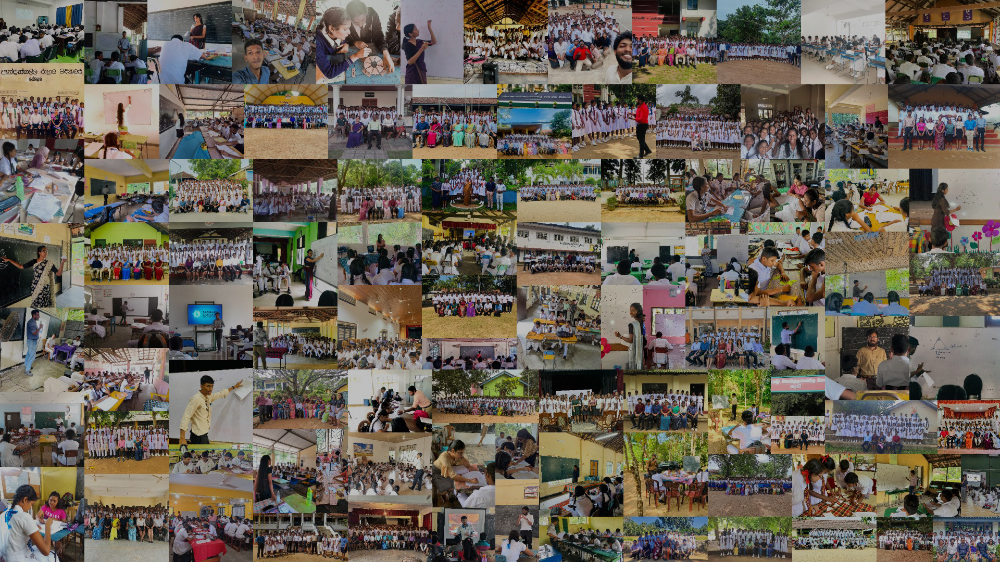

# GS-Dashboard 🇱🇰

Welcome to the GS-Dashboard, a stunning and interactive web application for visualizing data about Sri Lanka. Dive into a beautiful 3D map of the island, explore detailed district-level statistics, and gain insights through dynamic charts and visualizations. This project is built to be a modern, responsive, and user-friendly platform for data exploration.



## ✨ Features

- **Interactive 3D Map:** A high-fidelity 3D model of Sri Lanka, built with React Three Fiber.
- **Detailed Data Visualization:** In-depth charts and panels for district-level data using Chart.js and Recharts.
- **National Statistics:** Get a bird's-eye view of the entire country's data.
- **Responsive Design:** A seamless experience across all devices.
- **Modern UI/UX:** Beautifully designed components with smooth animations using Framer Motion.

## 🛠️ Tech Stack

This project is built with a modern and powerful tech stack:

- **Frontend:** [React](https://reactjs.org/), [React Router](https://reactrouter.com/)
- **3D Rendering:** [Three.js](https://threejs.org/), [React Three Fiber](https://docs.pmnd.rs/react-three-fiber/getting-started/introduction), [@react-three/drei](https://github.com/pmndrs/drei)
- **Charting:** [Chart.js](https://www.chartjs.org/), [Recharts](https://recharts.org/en-US/)
- **Styling:** [Bootstrap](https://getbootstrap.com/), [React-Bootstrap](https://react-bootstrap.github.io/), CSS3
- **Animation:** [Framer Motion](https://www.framer.com/motion/)

## About the Project

The GS-Dashboard is a React application that provides an interactive way to explore data about Sri Lanka. It uses `react-three-fiber` and `drei` to render a 3D model of the country, and `chart.js` and `recharts` to display statistical data. The application is designed to be responsive and user-friendly.

## Getting Started

These instructions will get you a copy of the project up and running on your local machine for development and testing purposes.

### Prerequisites

You need to have Node.js and npm installed on your machine. You can download them from [https://nodejs.org/](https://nodejs.org/).

### Installation

1. Clone the repo
   ```sh
   git clone https://github.com/your_username/gs-dashboard-new.git
   ```
2. Install NPM packages
   ```sh
   npm install
   ```

### Usage

To run the app in the development mode, use:

```sh
npm start
```

Open [http://localhost:3000](http://localhost:3000) to view it in the browser. The page will reload if you make edits.

To build the app for production, use:

```sh
npm run build
```

This will build the app for production to the `build` folder. It correctly bundles React in production mode and optimizes the build for the best performance.

## Folder Structure

The project has the following folder structure:

```
gs-dashboard-new/
├── public/
│   ├── index.html
│   └── ...
├── src/
│   ├── components/
│   ├── hooks/
│   ├── images/
│   ├── pages/
│   ├── utils/
│   ├── App.js
│   ├── index.js
│   └── ...
├── package.json
└── README.md
```

- **`public/`**: Contains the public assets and the `index.html` file.
- **`src/`**: Contains the main source code of the application.
  - **`components/`**: Contains the reusable React components.
  - **`hooks/`**: Contains custom React hooks.
  - **`images/`**: Contains the images used in the application.
  - **`pages/`**: Contains the main pages of the application.
  - **`utils/`**: Contains utility functions.
- **`package.json`**: Contains the project's metadata and dependencies.
- **`README.md`**: This file.

## Components

The `src/components/` directory contains the following components:

- **`DistrictChart.js`**: A chart component to display district-specific data.
- **`DistrictDetailPanel.js`**: A panel to show detailed information about a selected district.
- **`DistrictMap.js`**: The main component for the 3D map of Sri Lanka.
- **`NationalStats.js`**: A component to display national-level statistics.
- **`Navbar.js`**: The navigation bar of the application.
- **`OceanWaves.js`**: A component to render animated ocean waves around the map.
- **`SriLankaMap.js`**: The 3D model of Sri Lanka.
- **`SummaryChart.js`**: A chart component to display a summary of the data.

## Pages

The `src/pages/` directory contains the following pages:

- **`About.js`**: The about page of the application.
- **`Home.js`**: The home page of the application.
- **`MapSection.js`**: The section of the home page that contains the map and related components.

## Hooks

The `src/hooks/` directory contains the following custom hooks:

- **`useResponsive.js`**: A hook to handle responsive design.
- **`useDistrictData.js`**: A hook to fetch and manage district data.

## Utils

The `src/utils/` directory contains the following utility functions:

- **`responsive.js`**: Utility functions for responsive design.

## Available Scripts

In the project directory, you can run:

- **`npm start`**: Runs the app in the development mode.
- **`npm run build`**: Builds the app for production.
- **`npm test`**: Launches the test runner in the interactive watch mode.
- **`npm run eject`**: Removes the single dependency from your project.

## Dependencies

The project uses the following main dependencies:

- **`@react-three/drei`**: A collection of useful helpers and abstractions for `react-three-fiber`.
- **`@react-three/fiber`**: A React renderer for Three.js.
- **`bootstrap`**: A popular CSS framework.
- **`chart.js`**: A flexible JavaScript charting library.
- **`framer-motion`**: A library for creating animations.
- **`react`**: A JavaScript library for building user interfaces.
- **`react-bootstrap`**: Bootstrap components built with React.
- **`react-chartjs-2`**: React components for Chart.js.
- **`react-router-dom`**: Declarative routing for React.
- **`recharts`**: A composable charting library built on React components.
- **`three`**: A JavaScript 3D library.

## Contributing

Contributions are what make the open source community such an amazing place to learn, inspire, and create. Any contributions you make are **greatly appreciated**.

1. Fork the Project
2. Create your Feature Branch (`git checkout -b feature/AmazingFeature`)
3. Commit your Changes (`git commit -m 'Add some AmazingFeature'`)
4. Push to the Branch (`git push origin feature/AmazingFeature`)
5. Open a Pull Request

## License

Distributed under the MIT License. See `LICENSE` for more information.

## Contact

Your Name - your_email@example.com

Project Link: [https://github.com/your_username/gs-dashboard-new](https://github.com/your_username/gs-dashboard-new)
